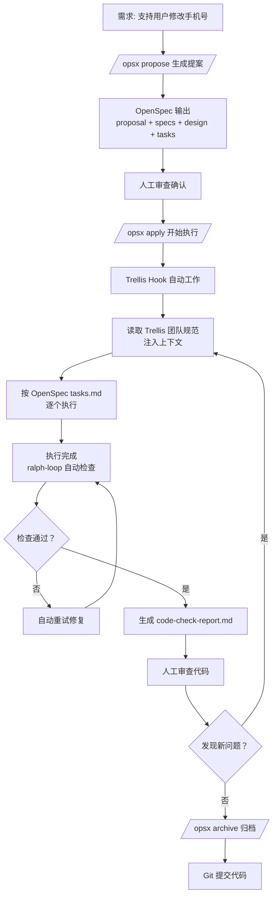

# Claude Code + OpenSpec + Trellis：概念澄清与最佳实践

> 团队级 AI 开发落地：理清 OpenSpec、Trellis、Skills 三者关系，辨析容易混淆的概念

---

## 目录

- [引言](#引言)
- [三者定位：一张表看懂区别](#三者定位一张表看懂区别)
- [容易混淆：OpenSpec vs Trellis 都有规范，区别在哪？](#容易混淆openspec-vs-trellis-都有规范区别在哪)
- [相似但不同：/opsx:explore vs Claude Code Plan Mode](#相似但不同opsxexplore-vs-claude-code-plan-mode)
- [完整协作流程](#完整协作流程)
- [最佳实践总结](#最佳实践总结)

---

## 引言

当团队开始规模化落地 AI 辅助开发，工具链会逐渐分层：`Claude Code` 是基础执行引擎，`Trellis` 提供流程框架，`OpenSpec` 提供需求规格管理。但很多人对这几个概念的边界分不清，特别是：

- OpenSpec 和 Trellis 都有"规范"，区别是什么？
- `/opsx:explore` 和 Claude Code 原生的 Plan Mode 是不是重复了？

本文帮你理清脉络。

---

## 三者定位：一张表看懂区别

| 概念 | 本质 | 核心作用 | 类比 |
|------|------|---------|------|
| **Claude Code** | 执行引擎 | Anthropic 官方 CLI，直接操作你的文件系统 | 工人 |
| **Trellis** | 流程框架 | 提供 Hook 机制 + 多 Agent 分工 + 知识分层 | 流水线 + 质量检查员 |
| **OpenSpec** | 规格管理 | 需求探索 → 设计 → 执行 → 归档全流程 | 施工图 + 项目档案 |
| **Skills** | 能力插件 | 封装可复用的特定能力（如 `check-backend`） | 专用工具 |

---

## 容易混淆：OpenSpec vs Trellis 都有规范，区别在哪？

一句话总结：

> **OpenSpec 管「这次要做什么」，Trellis 管「不管做什么都要遵守什么」**

### OpenSpec 的规范 → 针对当前需求

你要做"修改用户手机号"这个功能，OpenSpec 会生成：

```
openspec/changes/modify-phone/
├── proposal.md    # 需求概述：解决什么问题
├── specs/         # 功能规格：接口定义、业务规则
├── design.md      # 技术设计：表结构、依赖服务
└── tasks.md       # 任务拆分：分几步开发
```

**特点：**
- 每个需求一份
- 做完归档
- 针对特定功能，用完下次做新需求再生成

### Trellis 的规范 → 全团队通用

不管做"修改手机号"还是"用户注册"，这些规则都要遵守：

```
.trellis/spec/backend/
├── controller.md  # Controller 必须返回 Result<T>
├── service.md     # 业务逻辑放 Service 层
├── exception.md   # 异常处理规范
└── feign.md       # 远程调用规范
```

**特点：**
- 一份规范，所有需求共用
- 提交 Git 团队共享
- 变化相对缓慢，踩过坑才补充

### 类比理解

| 概念 | 建筑行业类比 |
|------|-------------|
| OpenSpec | 这套房子的施工图纸（几室几厅、阳台在哪） |
| Trellis | 建筑工程验收标准（钢筋标号、混凝土强度） |

二者配合：**先有图纸说清楚盖成什么样，再有标准说清楚必须按什么质量标准盖**。

---

## 相似但不同：/opsx:explore vs Claude Code Plan Mode

二者**目标相似**（都是开发前搞清楚需求，避免乱开干），但**深度和持久化不同**。

### 相同点

| 共同点 | 说明 |
|--------|------|
| 都在开发前做 | 编码前的探索分析阶段 |
| 都要对齐需求 | 避免理解错了就开干 |
| 都输出计划 | 给出怎么做的步骤 |
| 都要人确认 | 人批准了再开发 |

### 不同点

| 维度 | Claude Code **Plan Mode** | OpenSpec **/opsx:propose /explore** |
|------|---------------------------|----------------------------|
| **定位** | 单个任务的实现计划 | 需求探索 + 方案选型 + 完整设计 |
| **输出** | 实现步骤清单 | `proposal.md` + `specs/` + `design.md` + `tasks.md` |
| **覆盖范围** | 只计划怎么编码 | 从需求分析到技术设计全包 |
| **规范集成** | 需要你自己带上规范 | 自动集成 Trellis 团队规范 |
| **持久化** | 计划在会话里，容易丢失 | 产出物写入文件，存在 `openspec/`，Git 可追溯 |
| **执行衔接** | 需要你手动按计划一步步来 | `/opsx:apply` 自动按 tasks.md 执行 |
| **归档** | 无 | 完成后 `/opsx:archive` 永久归档 |

### 流程对比

**Claude Code 原生 Plan Mode：**
```
你：EnterPlanMode，帮我做个计划
  ↓
Claude 探索代码 → 制定计划 → 你批准 → 开始实现
  ↓
计划留在当前会话，会话结束就不好找了
```

**OpenSpec /opsx:propose（包含 explore）：**
```
你：/opsx:propose 修改手机号功能
  ↓
OpenSpec 自动：
  1. 探索需求边界（explore）
  2. 生成提案 proposal.md
  3. 生成功能规格 specs/
  4. 生成技术设计 design.md
  5. 拆分任务 tasks.md
  ↓
所有产出写到文件，存在 openspec/changes/
  ↓
你审查修改 → /opsx:apply 自动按文件执行
  ↓
完成后 /opsx:archive 归档，永久保留
```

---

## 完整协作流程

从需求到上线，三者怎么配合？用"修改手机号"举个完整例子：



---

## 最佳实践总结

### 1. 知识分层原则

```
SPEC（Trellis 团队规范，强约束）
  > 任务（OpenSpec 当前需求）
    > MEMORY（经验沉淀，弱参考）
      > 临时上下文
```

优先级不能乱。

### 2. 规范维护原则

> **发现问题 → 写入规范，不要口头提醒**

AI 写错一次，把正确规则写到 `.trellis/spec/`，下次就不会错了。团队一起踩坑，一起完善规范，越用越准。

### 3. 目录结构规范

```
your-project/
├── .trellis/
│   └── spec/              # Trellis 团队规范
│       ├── backend/
│       ├── frontend/
│       └── guides/
├── .claude/
│   ├── hooks/             # Trellis Hook 自动脚本
│   └── commands/          # 自定义 Slash 命令
└── openspec/
    ├── changes/           # 当前进行中的变更
    └── archive/           # 已完成归档
```

### 4. 团队协作 Git 约定

| 目录 | 是否提交 Git |
|------|------------|
| `.trellis/spec` | ✅ 必须提交，团队共享 |
| `.trellis/workspace` | ❌ 不要提交，个人本地 |
| `.claude/commands` | ✅ 提交，共享技能 |
| `openspec/archive` | ✅ 提交，可追溯 |
| `openspec/changes` | 可选，看团队习惯 |

### 5. 日常开发流程（三阶段）

| 阶段 | 操作 | 命令 |
|------|------|------|
| **需求阶段** | 探索 + 设计 | `/opsx:propose` |
| **开发阶段** | 按规范执行 + 自动检查 | `/opsx:apply` |
| **收尾阶段** | 归档 | `/opsx:archive` + 提交代码 |

---

## 最后：这套体系解决了什么问题

它把 AI Coding 从**"个人手工作坊"**升级成**"团队工业化生产"**：

- ✅ 新人来了看 `.trellis/spec/` 就知道团队编码习惯
- ✅ 每个人写出来的代码风格一致，CR 不用争论格式
- ✅ 需求先对齐设计再开发，避免做一半理解错了返工
- ✅ 知识沉淀在 Git，不是存在个人脑子里
- ✅ Hook 自动注入规范，不用每次手动给 AI 发一遍规范

核心思想就一句话：**人管规则，AI 出力气**。

---

*Last updated: 2026-04-09*
